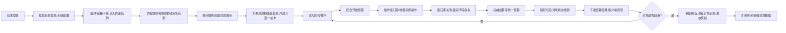
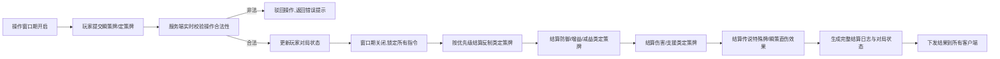

# 3v3同步回合制卡牌MOBA 技术开发文档
**文档版本**：V1.0 正式版
**适配项目版本**：游戏核心玩法V1.6 终版
**文档目的**：明确项目全链路技术实现方案，规范客户端、后台、辅助工具的开发标准，为个人开发提供可落地、可平滑迭代的技术路径，同时覆盖游戏后台开发核心学习内容
**核心玩法对齐**：1+2固定分路、瞬策-定策单窗口双轨体系、中枢塔PVE+BOSS战、分路崩塌3v3决胜、25回合硬封顶轻量化对局

---

## 文档目录
1.  第一部分：客户端技术开发方案
2.  第二部分：后台技术开发方案
3.  第三部分：辅助工具开发方案
4.  全项目开发里程碑排期
5.  代码与资源规范

---

# 第一部分：客户端技术开发方案
## 1.1 核心设计原则
1.  **表现与逻辑完全解耦**：客户端仅负责操作输入与视觉表现，所有对局结算逻辑完全收敛到后台权威结算库，客户端仅做本地预表现，最终以服务端返回结果为准；
2.  **轻量化低门槛**：适配个人开发美术能力弱的现状，优先使用成熟开源资源、模块化预制体，降低美术与动效开发成本；
3.  **AI友好型开发**：代码结构分层清晰、职责单一，适配AI辅助编程（Cursor/GitHub Copilot）的代码生成逻辑，提升开发效率；
4.  **双端兼容**：优先适配移动端+PC端，保证小屏设备的UI可读性与操作流畅度；
5.  **玩法强绑定**：所有模块完全贴合「瞬策-定策双轨体系」「同步回合制」核心玩法，不做冗余功能。

## 1.2 引擎选型与基础环境
### 1.2.1 最终引擎选型
**Unity 2022.3 LTS 稳定版**
- 免费规则：个人年营收≤10万美元可永久免费使用全功能，无任何开发限制；
- 核心优势：C#语言与后台开发技术栈可打通，AI辅助编程生态成熟，卡牌游戏资源与插件生态完善，3D场景开发门槛远低于UE5，完美适配个人开发节奏。

### 1.2.2 核心配套插件选型
| 插件名称 | 作用 | 选型理由 |
|----------|------|----------|
| UI Toolkit | 核心UI框架 | Unity官方原生UI框架，性能优于UGUI，支持样式复用、列表虚拟化，完美适配手牌滚动、卡牌列表等高频UI场景，AI可直接生成样式代码 |
| Odin Inspector | 编辑器扩展 | 可视化配置卡牌数据、角色属性，无需写大量编辑器代码，个人开发效率提升300%，免费个人版完全够用 |
| Mixamo | 角色动作库 | 免费提供上万套3D角色施法、攻击、受击、待机动作，支持一键绑定人形骨骼，完美解决美术能力弱的问题 |
| Spine | 2D卡牌动效 | 轻量化2D骨骼动画工具，实现卡牌边框、出牌动效，资源包体小，现成模板多 |
| Photon Unity Networking | 网络通信 | 轻量化网络框架，首发MVP阶段可快速实现联机，后续可平滑切换到自建后台 |
| DOTween | 动画插值 | 通用动画插值插件，实现卡牌拖拽、镜头特写、UI动效，代码极简，AI可直接生成可用代码 |

## 1.3 客户端整体分层架构
采用**四层低耦合架构**，每层仅对下层依赖，可单独测试、迭代，符合AI辅助编程的代码生成规范：
```
表现层 → 业务逻辑层 → 数据层 → 网络通信层
```

### 1.3.1 表现层
**核心职责**：所有视觉、音效、输入相关的内容，与业务逻辑完全解耦
| 模块名称 | 详细实现方案 |
|----------|--------------|
| 3D场景管理模块 | 1.  固定斜俯视角（高角度越肩视角，非垂直俯视角），用Virtual Camera实现固定机位，强力卡牌触发时可切换特写镜头；<br>2.  分路站位规则：solo路角色居中，双人路角色居左/居右，分路崩塌后自动切换到决战主路站位点；<br>3.  场景分块加载：分路场景、中枢塔场景、决战主路场景按需加载，降低内存占用 |
| 角色动画模块 | 1.  角色状态机：待机、施法、攻击、受击、死亡5个核心状态，与卡牌结算事件绑定，结算时触发对应动作；<br>2.  动作事件系统：施法动作到关键帧时触发特效播放，保证动作与特效同步；<br>3.  特写镜头触发：传说卡牌、斩杀卡牌结算时，自动触发角色特写镜头，播放专属施法动画 |
| UI界面模块 | 1.  核心界面：对局主界面、卡组编辑界面、匹配界面、登录界面、结算界面；<br>2.  对局主界面布局：底部手牌区、顶部回合信息区、左右分路状态面板、中间3D场景区、左下角队内信息区；<br>3.  卡牌UI规范：瞬策牌（亮霓虹蓝边框）、定策牌（暗哑黑+霓虹红边框）、稀有度分级边框，核心关键词自动高亮 |
| 特效与音效模块 | 1.  特效分层：卡牌出牌特效、技能结算特效、场景氛围特效，同屏特效数量限制，保证性能；<br>2.  音效分层：操作反馈音、结算提示音、背景音、角色语音，回合阶段切换强提示音 |
| 输入管理模块 | 1.  统一管理鼠标/触屏输入，实现卡牌拖拽、选中、放大预览、出牌提交操作；<br>2.  操作合法性预校验，非法操作（如费用不足、窗口期已关闭）直接拦截，给出提示 |

### 1.3.2 业务逻辑层
**核心职责**：客户端本地业务逻辑处理，预表现计算，与服务端状态同步
| 模块名称 | 详细实现方案 |
|----------|--------------|
| 回合流程管理模块 | 1.  基于有限状态机（FSM）实现，严格对应7个回合阶段：回合开始结算→操作窗口期→指令锁定→统一结算→濒死判定→回合结束；<br>2.  与服务端回合进度强同步，仅当服务端下发阶段切换指令后，才执行本地阶段切换；<br>3.  操作窗口期倒计时管理，时间结束后自动锁定本地指令，禁止操作 |
| 卡牌系统模块 | 1.  卡牌数据模型：与服务端完全一致的卡牌数据结构，包含卡牌ID、名称、职业、费用、双轨归属、类型、稀有度、效果、参数；<br>2.  卡牌生命周期管理：抽牌、手牌、打出、结算、弃牌、洗回牌库全流程；<br>3.  预表现逻辑：与服务端共用同一套结算逻辑库，打出卡牌时本地预计算效果，提前刷新界面，服务端结果返回后做最终校准 |
| 玩家状态管理模块 | 1.  管理本地玩家与同队玩家的血量、能量、护盾、buff/debuff、手牌、牌库、弃牌堆状态；<br>2.  敌方玩家仅展示可见信息（血量、护盾、公开buff），隐藏手牌、牌库等非公开信息，杜绝透视风险 |
| 队内通信模块 | 1.  同队玩家手牌、已提交定策指令实时同步，队内完全透明；<br>2.  快捷语音/文字聊天功能，适配移动端快速沟通 |

### 1.3.3 数据层
**核心职责**：所有本地数据的管理、缓存、持久化
| 模块名称 | 详细实现方案 |
|----------|--------------|
| 配置数据管理 | 1.  管理卡牌配置、职业配置、数值配置、场景配置，服务端启动时下发最新配置，本地做缓存；<br>2.  配置热更新：启动时对比版本号，自动拉取最新配置表，无需客户端发版 |
| 玩家数据管理 | 1.  持久化玩家账号信息、职业解锁、卡组配置、对局记录、成就数据；<br>2.  本地加密存储，防止玩家篡改本地数据 |
| 对局数据缓存 | 1.  缓存当前对局的所有状态数据、结算日志，支持掉线重连时快速恢复对局状态；<br>2.  对局结束后自动清理临时缓存 |

### 1.3.4 网络通信层
**核心职责**：与后台服务的通信、消息收发、连接管理
| 模块名称 | 详细实现方案 |
|----------|--------------|
| 连接管理 | 1.  基于WebSocket实现与后台的长连接管理，心跳检测、自动重连、断线重连机制；<br>2.  通信协议采用Protobuf序列化，体积小、速度快、类型安全 |
| 消息分发 | 1.  统一的消息收发入口，按消息类型分发到对应业务模块；<br>2.  消息优先级管理，回合结算、阶段切换等核心消息优先处理 |
| 安全加密 | 1.  通信内容采用AES对称加密，防止抓包篡改；<br>2.  所有发送到服务端的操作指令，都附带签名校验，防止非法请求 |

## 1.4 核心性能优化规范
1.  **DrawCall优化**：同类型卡牌UI采用图集打包，3D场景静态物体合并烘焙，同屏DrawCall控制在300以内；
2.  **内存优化**：卡牌资源、角色模型按需加载，对局结束后自动卸载未使用资源，常驻内存控制在2GB以内；
3.  **帧率优化**：移动端锁定30帧，PC端锁定60帧，非操作窗口期降低动画更新频率，减少性能消耗；
4.  **包体优化**：资源采用LZ4压缩，贴图按平台分级，首包体控制在500MB以内。

---

# 第二部分：后台技术开发方案
## 2.1 核心设计原则
1.  **权威结算优先**：所有影响对局结果的数值计算、逻辑判断100%在服务端完成，客户端仅负责输入操作与表现，从根源杜绝作弊；
2.  **强一致性保障**：严格保证所有客户端的回合进度、对局状态、结算结果完全一致，无先后手差异；
3.  **数据驱动扩展**：所有玩法内容通过配置表驱动，新增卡牌、职业、遗物无需修改核心代码；
4.  **分阶段可落地**：从MVP轻量化架构到商业级分布式架构平滑演进，无需推翻重构，适配个人开发节奏与后台学习路径；
5.  **高可用低延迟**：回合制游戏对延迟容忍度高，但必须保证服务稳定、不掉线、对局不回档，支持后续用户量上涨后的平滑扩容。

## 2.2 同步方案最终选型
**权威服状态同步**，完全适配项目的同步回合制玩法：
- 核心逻辑：客户端仅提交操作指令，服务端完成全量合法性校验与权威结算，下发最终结算结果，客户端仅做表现；
- 适配优势：完美贴合「操作窗口期统一提交→锁定→统一结算」的回合流程，开发难度低、防作弊能力强、无不同步风险；
- 预表现优化：客户端复用服务端的结算逻辑库做本地预表现，服务端结果返回后做最终校准，兼顾操作爽感与权威性。

## 2.3 分阶段架构方案
### 2.3.1 阶段一：MVP轻量化架构（首发上线用，个人开发可落地）
#### 架构总览
4层极简架构，所有模块可在单台2核4G云服务器上运行，零运维成本，开发周期4-6周，完全覆盖游戏核心功能。
```
客户端 → 网关层 → 核心逻辑层 → 数据存储层
```

#### 1. 网关层
- **核心职责**：客户端连接唯一入口，连接管理、消息转发、心跳检测、协议加密、非法请求拦截；
- **技术选型**：
  - C#栈：ASP.NET Core SignalR（极简开发，无需手动管理连接，个人开发首选）；
  - Go栈：Gin + Gorilla WebSocket（游戏后台行业主流，适合深耕后台开发）；
- **核心实现**：
  1.  管理玩家WebSocket长连接，心跳间隔30s，连续3次无心跳判定为掉线；
  2.  消息协议校验，非法格式、未登录请求直接拦截；
  3.  按消息类型，将玩家请求转发到对应逻辑服务；
  4.  处理玩家掉线重连，同步最新对局状态。

#### 2. 核心逻辑层
单体服务内拆分4个核心模块，后续可平滑拆分为独立微服务，每个模块仅负责单一职责：
| 模块名称 | 核心职责 | 详细实现方案 |
|----------|----------|--------------|
| 账号服务 | 玩家账号生命周期管理 | 1.  实现游客登录、账号密码登录、注册、密码找回功能；<br>2.  玩家基础信息管理：昵称、等级、职业解锁、成就数据；<br>3.  玩家卡组配置的增删改查，支持多卡组保存；<br>4.  密码采用加盐哈希存储，绝对禁止明文存储 |
| 匹配服务 | 玩家匹配与对局创建 | 1.  匹配队列管理：按玩家位置（solo/双人组）、等级匹配，严格遵循「1solo+2双人组」的3v3阵容规则；<br>2.  匹配超时机制：超过60s自动放宽匹配条件，保证匹配效率；<br>3.  匹配成功后，调用房间服务创建对局房间，将玩家拉入房间 |
| 房间服务 | 对局生命周期管理与权威结算 | 【后台核心模块】<br>1.  对局生命周期管理：创建→对局中→结束→销毁，单局最长生命周期25回合；<br>2.  回合流程管理：严格控制回合阶段切换，同步回合进度给所有客户端；<br>3.  操作收集与校验：收集玩家操作指令，做全量合法性校验（卡牌是否存在、费用是否足够、目标是否合法、是否在操作窗口期），非法操作直接驳回；<br>4.  权威结算：调用独立结算库，完成回合全量结算，生成结算日志与对局状态；<br>5.  结果下发：将结算结果、对局状态同步给所有客户端；<br>6.  掉线重连处理：玩家重连后，下发完整的对局最新状态，保证玩家无缝回归对局 |
| 配置服务 | 游戏配置管理 | 1.  管理所有游戏配置：卡牌配置、职业配置、遗物配置、数值配置、规则配置；<br>2.  服务启动时加载配置到内存，支持热重载，修改配置无需重启服务；<br>3.  客户端启动时，下发最新配置表，保证前后端配置完全一致 |

#### 3. 独立权威结算库
- **核心定位**：后台的灵魂，完全独立、无状态、与业务逻辑解耦，前后端共用同一套代码，保证结算逻辑100%一致；
- **核心内容**：
  1.  回合状态机：严格实现7个回合阶段的流转逻辑；
  2.  卡牌效果系统：基于组件化设计，将所有卡牌效果拆分为独立组件（造成伤害、抽牌、叠buff、反制等），通过配置表绑定卡牌与效果组件，新增卡牌无需修改代码；
  3.  结算优先级引擎：严格按照既定优先级，按顺序结算所有卡牌效果，同优先级效果同时结算；
  4.  随机数生成器：固定种子的伪随机数生成器，保证结算逻辑可复现，方便排查问题；
  5.  对局上下文：管理对局内所有玩家的状态、场景状态、回合信息，结算逻辑仅能通过上下文修改对局状态。

#### 4. 数据存储层
- **结构化数据存储**：MySQL 8.0，存储玩家永久数据，核心表结构如下：
  ```sql
  -- 玩家账号表
  CREATE TABLE `player_account` (
    `player_id` bigint NOT NULL AUTO_INCREMENT COMMENT '玩家唯一ID',
    `account` varchar(64) NOT NULL COMMENT '账号',
    `password_hash` varchar(128) NOT NULL COMMENT '加盐哈希密码',
    `nickname` varchar(32) NOT NULL COMMENT '玩家昵称',
    `level` int NOT NULL DEFAULT '1' COMMENT '玩家等级',
    `create_time` datetime NOT NULL DEFAULT CURRENT_TIMESTAMP,
    `update_time` datetime NOT NULL DEFAULT CURRENT_TIMESTAMP ON UPDATE CURRENT_TIMESTAMP,
    PRIMARY KEY (`player_id`),
    UNIQUE KEY `uk_account` (`account`)
  ) ENGINE=InnoDB DEFAULT CHARSET=utf8mb4 COMMENT='玩家账号表';

  -- 玩家卡组表
  CREATE TABLE `player_deck` (
    `deck_id` bigint NOT NULL AUTO_INCREMENT COMMENT '卡组唯一ID',
    `player_id` bigint NOT NULL COMMENT '玩家ID',
    `hero_id` int NOT NULL COMMENT '职业ID',
    `deck_name` varchar(32) NOT NULL COMMENT '卡组名称',
    `card_config` json NOT NULL COMMENT '卡牌配置JSON',
    `create_time` datetime NOT NULL DEFAULT CURRENT_TIMESTAMP,
    `update_time` datetime NOT NULL DEFAULT CURRENT_TIMESTAMP ON UPDATE CURRENT_TIMESTAMP,
    PRIMARY KEY (`deck_id`),
    KEY `idx_player_id` (`player_id`)
  ) ENGINE=InnoDB DEFAULT CHARSET=utf8mb4 COMMENT='玩家卡组表';

  -- 对局记录表
  CREATE TABLE `battle_record` (
    `battle_id` bigint NOT NULL AUTO_INCREMENT COMMENT '对局唯一ID',
    `battle_time` datetime NOT NULL COMMENT '对局时间',
    `win_team` tinyint NOT NULL COMMENT '获胜队伍',
    `player_ids` json NOT NULL COMMENT '对局玩家ID列表',
    `battle_duration` int NOT NULL COMMENT '对局时长(秒)',
    `battle_round` int NOT NULL COMMENT '对局回合数',
    `create_time` datetime NOT NULL DEFAULT CURRENT_TIMESTAMP,
    PRIMARY KEY (`battle_id`),
    KEY `idx_battle_time` (`battle_time`)
  ) ENGINE=InnoDB DEFAULT CHARSET=utf8mb4 COMMENT='对局记录表';
  ```
- **临时数据存储**：Redis 7.0，存储高频访问的临时数据：
  1.  玩家在线状态、连接信息；
  2.  对局房间状态、临时对局数据；
  3.  匹配队列数据；
  4.  游戏配置缓存。

#### 5. 通信协议设计
采用Protobuf定义前后端通信协议，核心协议示例如下：
```protobuf
syntax = "proto3";
package game;

// 玩家操作指令枚举
enum OperationType {
  OP_UNKNOWN = 0;
  OP_PLAY_INSTANT_CARD = 1; // 打出瞬策牌
  OP_COMMIT_PLAN_CARD = 2; // 提交定策牌
  OP_CANCEL_PLAN_CARD = 3; // 取消定策牌
  OP_COMMIT_MOVE = 4; // 提交移动指令
}

// 玩家操作请求
message PlayerOperationReq {
  int64 player_id = 1;
  int64 battle_id = 2;
  OperationType op_type = 3;
  bytes op_data = 4; // 操作详情JSON
  int64 timestamp = 5;
  string sign = 6; // 签名校验
}

// 回合结算响应
message RoundSettleResp {
  int64 battle_id = 1;
  int32 round_num = 2;
  bytes settle_log = 3; // 完整结算日志
  bytes battle_state = 4; // 最新对局状态
  int32 next_round_state = 5; // 下一个回合阶段
}
```

#### 6. 基础防作弊设计
1.  **操作全量校验**：所有玩家操作必须经过服务端合法性校验，非法操作直接驳回并记录日志；
2.  **信息按需下发**：对手手牌、未结算定策牌、牌库内容等非公开信息，绝对不下发到客户端，仅结算时披露生效内容；
3.  **通信加密**：所有通信内容采用AES对称加密，操作指令附带签名校验，防止抓包篡改；
4.  **异常行为检测**：实时检测玩家异常操作频率、异常数值变化，多次异常直接踢出对局并封号。

### 2.3.2 阶段二：商业级分布式架构（长线运营/职业进阶用）
当用户量上涨后，可平滑升级为国内大厂标准的分布式微服务架构，完整覆盖高并发、高可用、容灾扩容、运营活动等商业级需求：
```
客户端 → 接入层 → 逻辑微服务层 → 数据层 → 公共服务层 → 运维监控层
```
1.  **接入层**：LVS+Nginx反向代理+网关集群，支持百万级并发连接，实现负载均衡、流量控制、DDoS防护；
2.  **逻辑微服务层**：将单体服务拆分为独立部署的微服务集群：登录服、账号服、匹配服、房间服集群、好友服、排行榜服、邮件服、运营活动服、充值服，每个服务独立扩容；
3.  **数据层**：MySQL读写分离+分库分表、Redis集群分片、MongoDB存储对局日志与行为数据，支持海量数据存储；
4.  **公共服务层**：配置中心、注册中心、消息队列、全链路追踪系统，解决微服务治理问题；
5.  **运维监控层**：Prometheus+Grafana监控、ELK日志收集系统、告警系统、自动化发布平台，实现7*24小时稳定运行；
6.  **进阶防作弊系统**：行为分析系统、对局回放系统、反外挂引擎，实时检测并拦截外挂行为。

## 2.4 核心业务流程详解
### 2.4.1 完整对局生命周期流程


### 2.4.2 单回合卡牌结算流程


---

# 第三部分：辅助工具开发方案
## 3.1 工具核心设计目标
1.  解决纯文本写卡牌的繁琐问题，实现可视化卡牌配置、预览、校验，无需修改代码即可新增/修改卡牌；
2.  提供单机对局模拟能力，无需启动服务器即可测试卡牌效果、流派平衡、结算逻辑；
3.  降低配置出错概率，自动校验配置合法性，避免前后端配置不一致的问题；
4.  完全贴合个人开发节奏，轻量化、低代码、可复用，开发周期控制在1-2周。

## 3.2 核心工具1：Unity内置卡牌编辑器（核心工具）
### 3.2.1 核心功能
1.  可视化卡牌配置：无需手动写JSON/Excel，在Unity编辑器内通过图形界面配置卡牌所有属性；
2.  实时卡牌预览：配置完成后，实时预览卡牌在游戏内的最终显示效果，包括边框、文本、动效；
3.  配置合法性校验：自动校验卡牌配置是否合法（如费用是否为正、效果参数是否完整、双轨归属是否正确），非法配置给出明确提示；
4.  配置批量导出：一键导出前后端通用的卡牌配置JSON/Excel，保证前后端配置100%一致；
5.  卡牌分类管理：按职业、类型、稀有度、双轨归属分类管理卡牌，支持筛选、搜索、批量修改。

### 3.2.2 技术实现方案
- 基于Unity Editor原生编辑器扩展开发，配合Odin Inspector实现可视化界面，无需额外依赖；
- 卡牌数据采用ScriptableObject存储，每个卡牌对应一个独立的资源文件，支持版本管理；
- 内置卡牌效果组件库，配置时可直接选择效果组件，填写对应参数，无需写代码；
- 一键导出功能：自动将所有卡牌配置合并为统一的JSON文件，同时生成Excel配置表，供前后端使用。

### 3.2.3 核心代码示例
```csharp
// 卡牌数据模型
[CreateAssetMenu(fileName = "NewCard", menuName = "Game/Card")]
public class CardData : ScriptableObject
{
    [Header("基础信息")]
    public int cardId;
    public string cardName;
    public HeroType belongHero;
    public CardRarity rarity;
    public CardTrackType trackType; // 瞬策/定策
    public CardType cardType;
    public int cost;

    [Header("卡牌效果")]
    public List<CardEffectData> effects = new List<CardEffectData>();

    [Header("美术资源")]
    public Sprite cardIcon;
    public Sprite cardFrame;
    public GameObject cardPrefab;

    [TextArea] public string cardDesc;
}

// 卡牌效果数据
[System.Serializable]
public class CardEffectData
{
    public CardEffectType effectType;
    public int[] effectParams;
    public string triggerCondition;
}

// 编辑器窗口
public class CardEditorWindow : EditorWindow
{
    private CardData currentCard;
    private Vector2 scrollPos;

    [MenuItem("Game Tools/卡牌编辑器")]
    public static void ShowWindow()
    {
        GetWindow<CardEditorWindow>("卡牌编辑器");
    }

    private void OnGUI()
    {
        EditorGUILayout.Space();
        currentCard = (CardData)EditorGUILayout.ObjectField("当前编辑卡牌", currentCard, typeof(CardData), false);
        EditorGUILayout.Space();

        if (currentCard == null)
        {
            EditorGUILayout.HelpBox("请选择要编辑的卡牌", MessageType.Info);
            return;
        }

        scrollPos = EditorGUILayout.BeginScrollView(scrollPos);
        SerializedObject serializedObject = new SerializedObject(currentCard);
        SerializedProperty prop = serializedObject.GetIterator();
        prop.NextVisible(true);
        while (prop.NextVisible(false))
        {
            EditorGUILayout.PropertyField(prop, true);
        }
        serializedObject.ApplyModifiedProperties();
        EditorGUILayout.EndScrollView();

        EditorGUILayout.Space();
        if (GUILayout.Button("校验配置合法性"))
        {
            ValidateCardConfig(currentCard);
        }
        if (GUILayout.Button("导出全部卡牌配置"))
        {
            ExportAllCardConfig();
        }
    }
}
```

## 3.3 核心工具2：单机对局模拟器
### 3.3.1 核心功能
1.  无需启动后台服务，在Unity编辑器内即可模拟完整对局流程，测试卡牌效果、combo、流派强度；
2.  支持手动控制双方玩家的操作，模拟各种对局场景，测试极限情况；
3.  完整的结算日志输出，每一步结算都有详细日志，快速定位卡牌逻辑bug；
4.  回合快进/暂停功能，快速模拟多回合对局，测试卡组循环稳定性；
5.  数值面板实时展示，玩家血量、能量、手牌、牌库、buff/debuff状态实时更新。

### 3.3.2 技术实现方案
- 直接复用后台的权威结算库，保证模拟器的结算逻辑与线上服务端100%一致，测试结果完全可信；
- 基于Unity Editor窗口开发，提供简易的操作界面，可快速选择卡组、提交操作、推进回合；
- 内置日志系统，将结算日志实时输出到编辑器控制台，支持按回合、按卡牌筛选日志；
- 支持对局存档/读档，可保存特定对局场景，重复测试卡牌效果。

## 3.4 核心工具3：配置表生成与校验工具
### 3.4.1 核心功能
1.  Excel转JSON工具：策划在Excel里填写的卡牌、职业、数值配置，一键转换为前后端通用的JSON格式；
2.  配置一致性校验：自动对比前后端配置的版本号、MD5值，保证前后端配置完全一致，避免因配置不一致导致的bug；
3.  配置版本管理：自动生成配置版本号，记录配置修改日志，支持回滚到历史版本；
4.  配置热更包生成：一键生成配置热更包，上传到CDN后，客户端可自动更新最新配置，无需发版。

### 3.4.2 技术实现方案
- 基于.NET Core开发的控制台工具，跨平台可用，无需依赖Unity；
- 采用EPPlus读取Excel文件，支持复杂的表格结构、多Sheet管理；
- 内置校验规则，可自定义配置的合法范围，自动拦截非法配置；
- 自动生成配置对应的C#/Go结构体代码，无需手动写数据模型，保证前后端数据结构完全一致。

---

# 第四部分：全项目开发里程碑排期
| 阶段 | 周期 | 核心交付物 | 核心学习目标 |
|------|------|------------|--------------|
| 第一阶段：基础环境搭建 | 1周 | Unity工程搭建、后台基础工程搭建、Git仓库搭建、开发规范制定 | 熟悉Unity/后台技术栈的基础环境配置 |
| 第二阶段：核心结算库开发 | 2周 | 独立权威结算库、回合状态机、卡牌效果组件系统、控制台单机模拟测试 | 掌握游戏后台核心的权威结算逻辑、回合制状态机设计 |
| 第三阶段：MVP后台开发 | 4周 | 网关、账号服务、匹配服务、房间服务、数据存储层开发、前后端联调通 | 掌握游戏后台完整模块设计、网络通信、数据存储开发 |
| 第四阶段：客户端核心开发 | 4周 | 3D场景搭建、UI框架开发、卡牌系统、回合流程管理、网络通信模块开发 | 掌握Unity客户端分层架构、UI开发、3D场景与动画开发 |
| 第五阶段：辅助工具开发 | 2周 | 卡牌编辑器、单机对局模拟器、配置表工具开发 | 掌握Unity编辑器扩展、工具链开发思路 |
| 第六阶段：联调与测试 | 2周 | 完整3v3对局联调、卡牌效果测试、bug修复、性能优化 | 掌握前后端联调、bug排查、性能优化方法 |
| 第七阶段：MVP上线 | 1周 | 客户端打包、服务端部署、线上环境测试 | 掌握游戏上线部署、运维基础 |

---

# 第五部分：代码与资源规范
## 5.1 代码规范
1.  采用C#/Go官方编码规范，命名采用帕斯卡命名法（类、方法、公共字段）与驼峰命名法（私有字段、局部变量）；
2.  每个类、方法必须有XML注释，核心业务逻辑必须有详细的行内注释；
3.  每个方法职责单一，单方法代码行数不超过100行，避免超大方法；
4.  所有魔法数、固定配置必须定义为常量，禁止硬编码；
5.  代码提交必须写清晰的提交信息，按功能模块提交，禁止一次性提交大量无关代码。

## 5.2 资源规范
1.  资源目录按类型分类：Prefabs、Textures、Models、Animations、Audio、Scripts，每个类型下再按业务模块细分；
2.  贴图规范：移动端最大尺寸2048*2048，采用ETC2压缩格式；PC端最大尺寸4096*4096，采用DXT5压缩格式；
3.  模型规范：单个角色模型面数不超过5000面，骨骼数量不超过30根；
4.  音频规范：背景音乐采用OGG格式，音效采用WAV格式，单音效时长不超过10s。