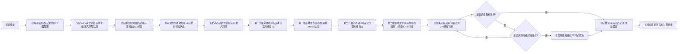
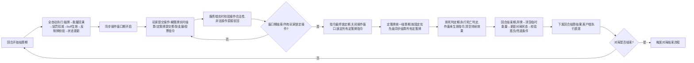

# 3v3同步回合制卡牌MOBA 技术开发文档
**文档版本**：V3.0 全玩法适配正式版
**适配项目玩法版本**：游戏核心玩法V3.0 全规则闭环优化版
**文档状态**：100%对齐最新玩法框架，无规则冲突，可直接用于落地开发
**文档目的**：明确项目全链路技术实现方案，规范客户端、后台、辅助工具的开发标准，为个人开发提供可落地、可平滑迭代的技术路径，同时覆盖游戏后台开发核心学习内容
**核心玩法对齐**：1+2固定分路、瞬策-定策单窗口双轨体系、永久换路/临时支援双隔离移动规则、中枢塔多阶段PVE+阵营BOSS战、分路崩塌3v3决胜、对局硬兜底封顶机制
---
## 文档目录
1.  第一部分：客户端技术开发方案
2.  第二部分：后台技术开发方案
3.  第三部分：辅助工具开发方案
4.  全项目开发里程碑排期
5.  代码与资源规范
---
# 第一部分：客户端技术开发方案
## 1.1 核心设计原则
1.  **表现与逻辑完全解耦**：客户端仅负责操作输入与视觉表现，所有对局结算逻辑100%收敛到后台权威结算库，客户端仅做本地预表现，最终以服务端返回结果为准，彻底杜绝作弊风险；
2.  **玩法强绑定无冗余**：所有模块完全贴合「瞬策-定策双轨体系」「同步回合制」「分路隔离与联动」核心玩法，不做与玩法无关的冗余功能；
3.  **轻量化低门槛**：适配个人开发美术能力弱的现状，优先使用成熟开源资源、模块化预制体，降低美术与动效开发成本；
4.  **AI友好型开发**：代码结构分层清晰、职责单一，适配AI辅助编程（Cursor/GitHub Copilot）的代码生成逻辑，提升开发效率；
5.  **双端兼容**：优先适配移动端+PC端，保证小屏设备的UI可读性与操作流畅度；
6.  **强同步一致性**：所有回合阶段、操作窗口期、对局状态完全以服务端指令为准，客户端仅做跟随，保证6名玩家对局体验完全一致，无先后手差异。

## 1.2 引擎选型与基础环境
### 1.2.1 最终引擎选型
**Unity 2022.3 LTS 稳定版**
- 免费规则：个人年营收≤10万美元可永久免费使用全功能，无任何开发限制；
- 核心优势：C#语言与后台开发技术栈可打通，AI辅助编程生态成熟，卡牌游戏资源与插件生态完善，3D场景开发门槛远低于UE5，完美适配个人开发节奏。

### 1.2.2 核心配套插件选型
| 插件名称 | 核心作用 | 选型适配理由 |
|----------|----------|--------------|
| UI Toolkit | 核心UI框架 | Unity官方原生UI框架，性能优于UGUI，支持样式复用、列表虚拟化，完美适配手牌滚动、卡牌列表、分路状态面板等高频UI场景，AI可直接生成样式代码 |
| Odin Inspector | 编辑器扩展 | 可视化配置卡牌数据、角色属性、对局阶段配置，无需写大量编辑器代码，个人开发效率提升300%，免费个人版完全够用 |
| Mixamo | 角色动作库 | 免费提供上万套3D角色施法、攻击、受击、待机动作，支持一键绑定人形骨骼，完美解决美术能力弱的问题 |
| Spine | 2D卡牌动效 | 轻量化2D骨骼动画工具，实现卡牌边框、出牌动效、稀有度特效，资源包体小，现成模板多，完美适配瞬策/定策牌的视觉区分需求 |
| DOTween | 动画插值 | 通用动画插值插件，实现卡牌拖拽、镜头特写、UI动效、角色换路/支援位移动画，代码极简，AI可直接生成可用代码 |
| MessagePack | 序列化工具 | 前后端通信序列化方案，体积更小、速度更快，完美适配回合制高频消息收发场景，替代原有Protobuf，与C#技术栈兼容性更强 |

## 1.3 客户端整体分层架构
采用**四层低耦合架构**，每层仅对下层依赖，可单独测试、迭代，符合AI辅助编程的代码生成规范，完全对齐玩法核心流程：
```
表现层 → 业务逻辑层 → 数据层 → 网络通信层
```

### 1.3.1 表现层
**核心职责**：所有视觉、音效、输入相关的内容，与业务逻辑完全解耦，严格遵循服务端下发的状态执行表现
| 模块名称 | 详细实现方案（完全适配V3.0玩法） |
|----------|------------------------------------|
| 3D场景管理模块 | 1.  固定斜俯视角（高角度越肩视角，非垂直俯视角），用Virtual Camera实现固定机位，传说卡牌、斩杀结算时可切换特写镜头；<br>2.  分路站位规则：solo路角色居中，双人路角色居左/居右，分路间做视觉隔离，支援/换路时触发平滑位移动画；<br>3.  场景分块加载：solo路场景、双人路场景、中枢塔场景、决战主路场景按需加载，对局阶段切换时自动加载/卸载对应场景，降低内存占用；<br>4.  中枢塔场景分阶段加载：小怪清剿阶段独立房间、BOSS讨伐阶段全局场景，分批次加载，避免卡顿 |
| 角色动画模块 | 1.  角色状态机：待机、施法、攻击、受击、死亡、位移6个核心状态，与卡牌结算事件强绑定，服务端下发结算指令后触发对应动作；<br>2.  动作事件系统：施法动作到关键帧时触发特效播放，保证动作与特效同步；<br>3.  视觉差异化：瞬策牌触发快速施法动作，定策牌触发预摆施法动作，结算时触发完整施法动画，强化双轨卡牌的操作反馈；<br>4.  特写镜头触发：传说卡牌、斩杀、中枢最终攻击结算时，自动触发角色特写镜头，播放专属施法动画 |
| UI界面模块 | 1.  核心界面：对局主界面、卡组编辑界面、匹配界面、登录界面、结算界面、中枢塔选择界面、投票弹窗界面；<br>2.  对局主界面布局：底部手牌区、顶部回合阶段/倒计时区、左右分路状态面板、中间3D场景区、左下角队内信息区、右下角操作锁定按钮；<br>3.  卡牌UI强区分规范：瞬策牌（亮霓虹蓝边框）、定策牌（暗哑黑+霓虹红边框）、反制牌（黄黑警示边框）、传说牌（专属动态边框），核心关键词、跨路生效标签自动高亮；<br>4.  队内信息透明区：同路玩家手牌、已提交定策牌指令实时展示，队内完全可见；<br>5.  强提示UI：反制牌预警弹窗、操作窗口期倒计时、非法操作提示、中枢塔卡牌无效提示、投票弹窗、投降确认弹窗 |
| 特效与音效模块 | 1.  特效分层：卡牌出牌特效、技能结算特效、场景氛围特效，同屏特效数量限制，保证性能；<br>2.  音效分层：操作反馈音、结算提示音、回合阶段切换强提示音、背景音、角色语音；<br>3.  关键节点强反馈：操作窗口期即将结束、反制牌触发、支援请求、对局胜负结算时，触发专属音效与震动反馈（移动端） |
| 输入管理模块 | 1.  统一管理鼠标/触屏输入，实现卡牌拖拽、选中、放大预览、出牌提交、定策牌修改/取消操作；<br>2.  操作合法性预校验：非法操作（如费用不足、窗口期已关闭、跨路违规操作、目标不合法）直接拦截，给出明确UI提示；<br>3.  操作锁定功能：玩家完成定策牌提交后，可手动锁定指令，避免误操作 |
| 对局回放模块 | 1.  基于服务端结算日志，实现完整对局回放功能，支持暂停、快进、回合跳转；<br>2.  对局结束后自动保存回放文件，支持玩家查看、分享，同时用于问题排查与反作弊校验 |

### 1.3.2 业务逻辑层
**核心职责**：客户端本地业务逻辑处理、预表现计算、与服务端状态强同步，完全对齐玩法的回合流程与规则
| 模块名称 | 详细实现方案（完全适配V3.0玩法） |
|----------|------------------------------------|
| 回合流程管理模块 | 1.  基于有限状态机（FSM）实现，严格对应玩法定义的7个回合阶段：回合开始结算期→同步操作窗口期→指令最终锁定期→定策牌统一结算期→濒死判定期→回合结束期，流程不可逆；<br>2.  与服务端回合进度强同步，仅当服务端下发阶段切换指令后，才执行本地阶段切换，绝对禁止客户端自主推进回合；<br>3.  操作窗口期倒计时管理：与服务端时间戳校准，本地仅做倒计时表现，时间结束后自动锁定本地指令，禁止任何卡牌操作；<br>4.  对局阶段管理：分路对线期→中枢塔发育战→决战死斗期的全流程阶段切换，与服务端下发的对局状态强绑定 |
| 卡牌系统模块 | 1.  卡牌数据模型：与服务端完全一致的卡牌数据结构，包含卡牌ID、名称、职业、费用、双轨归属、子类型、标签、效果、参数、结算优先级；<br>2.  双轨卡牌生命周期管理：<br>   - 瞬策牌：手牌→打出→实时结算→弃牌全流程，与服务端实时校验合法性；<br>   - 定策牌：手牌→提交锁定→修改/取消→窗口期关闭→统一结算→弃牌全流程；<br>3.  预表现逻辑：与服务端共用同一套结算逻辑库，打出卡牌时本地预计算效果，提前刷新界面，服务端结果返回后做最终校准；<br>4.  卡组循环管理：本地同步玩家牌库、手牌、弃牌堆状态，仅展示服务端下发的可见信息，杜绝透视风险 |
| 玩家与分路状态管理模块 | 1.  管理本地玩家与同队玩家的血量、能量、护盾、buff/debuff、锁定归属分路、当前所在分路状态；<br>2.  敌方玩家仅展示可见信息（血量、护盾、公开buff、分路位置），隐藏手牌、牌库、未结算定策牌等非公开信息；<br>3.  换路/支援状态管理：同步服务端下发的换路申请、支援投票、位置变更状态，触发对应UI与动画表现；<br>4.  掉线/重连状态管理：实时同步玩家连接状态，掉线时弹出提示，重连后自动拉取最新对局状态，无缝恢复对局 |
| 中枢塔流程管理模块 | 1.  管理中枢塔全流程状态：进入前血量锁定→小怪清剿阶段→BOSS讨伐阶段→出塔血量恢复；<br>2.  小怪难度选择界面管理：每场小怪战斗前，展示难度档位、奖励预览，提交玩家选择指令；<br>3.  中枢塔内卡牌生效提示：玩家选中敌方玩家为目标时，实时弹出UI提示【当前场景无法对敌方玩家触发该效果】；<br>4.  BOSS战状态管理：同步阵营总伤害、BOSS状态、玩家存活/观战状态 |
| 队内通信与投票模块 | 1.  同队玩家手牌、已提交定策指令实时同步，队内完全透明，与服务端状态强绑定；<br>2.  投票功能管理：支援申请投票、换路申请投票、投降投票的发起、选择、结果同步，实时更新投票状态UI；<br>3.  快捷语音/文字聊天功能，适配移动端快速沟通需求 |

### 1.3.3 数据层
**核心职责**：所有本地数据的管理、缓存、持久化，与服务端配置完全一致
| 模块名称 | 详细实现方案 |
|----------|--------------|
| 配置数据管理 | 1.  管理卡牌配置、职业配置、数值配置、对局阶段配置、场景配置，服务端启动时下发最新配置，本地做加密缓存；<br>2.  配置热更新：启动时对比版本号，自动拉取最新配置表，无需客户端发版；<br>3.  配置合法性校验：本地配置与服务端配置MD5校验不一致时，自动重新拉取，杜绝前后端配置不一致导致的bug |
| 玩家数据管理 | 1.  持久化玩家账号信息、职业解锁、卡组配置、对局记录、成就数据；<br>2.  本地AES加密存储，防止玩家篡改本地数据；<br>3.  卡组配置管理：支持多卡组保存、编辑、导入导出，与服务端数据实时同步 |
| 对局数据缓存 | 1.  缓存当前对局的所有状态数据、完整结算日志，支持掉线重连时快速恢复对局状态；<br>2.  对局结束后自动清理临时缓存，仅保留回放文件与对局记录 |

### 1.3.4 网络通信层
**核心职责**：与后台服务的通信、消息收发、连接管理，保证消息的实时性与可靠性
| 模块名称 | 详细实现方案 |
|----------|--------------|
| 连接管理 | 1.  基于WebSocket实现与后台的长连接管理，心跳间隔30s，连续3次无心跳判定为掉线，触发自动重连机制；<br>2.  通信协议采用MessagePack序列化，体积小、速度快、类型安全，与C#技术栈完美适配；<br>3.  断线重连机制：玩家重连后，自动拉取完整的对局最新状态，无缝回归对局，不丢失任何操作进度 |
| 消息分发 | 1.  统一的消息收发入口，按消息类型分发到对应业务模块；<br>2.  消息优先级管理：回合阶段切换、结算结果、对局胜负等核心消息优先处理，聊天、状态同步等非核心消息次优先级处理；<br>3.  消息重发机制：核心操作指令未收到服务端响应时，自动重发，保证操作不丢失 |
| 安全加密 | 1.  通信内容采用AES对称加密，防止抓包篡改；<br>2.  所有发送到服务端的操作指令，都附带时间戳+签名校验，防止非法请求与重放攻击；<br>3.  非法消息拦截：格式错误、签名校验失败的消息直接丢弃，记录异常日志 |

## 1.4 核心性能优化规范
1.  **DrawCall优化**：同类型卡牌UI采用图集打包，3D场景静态物体合并烘焙，同屏DrawCall控制在300以内；
2.  **内存优化**：卡牌资源、角色模型、场景资源按需加载，对局结束后自动卸载未使用资源，常驻内存控制在2GB以内；
3.  **帧率优化**：移动端锁定30帧，PC端锁定60帧，非操作窗口期降低动画更新频率，减少性能消耗；
4.  **包体优化**：资源采用LZ4压缩，贴图按平台分级，首包体控制在500MB以内；
5.  **网络优化**：非核心消息合并发送，减少网络IO次数，核心操作指令单独发送，保证低延迟。

---
# 第二部分：后台技术开发方案
## 2.1 核心设计原则
1.  **权威结算优先**：所有影响对局结果的数值计算、逻辑判断100%在服务端完成，客户端仅负责输入操作与表现，从根源杜绝作弊；
2.  **强一致性保障**：严格保证所有客户端的回合进度、对局状态、结算结果完全一致，无先后手差异，完全适配同步回合制玩法；
3.  **数据驱动扩展**：所有玩法内容通过配置表驱动，新增卡牌、职业、遗物、对局阶段无需修改核心代码；
4.  **分阶段可落地**：从MVP轻量化架构到商业级分布式架构平滑演进，无需推翻重构，适配个人开发节奏与后台学习路径；
5.  **高可用低延迟**：回合制游戏对延迟容忍度高，但必须保证服务稳定、不掉线、对局不回档，支持后续用户量上涨后的平滑扩容；
6.  **规则零冲突**：所有逻辑100%对齐V3.0玩法框架的底层铁律，无任何规则例外与逻辑冲突。

## 2.2 同步方案最终选型
**权威服状态同步**，完全适配项目的同步回合制玩法：
- 核心逻辑：客户端仅提交操作指令，服务端完成全量合法性校验与权威结算，下发最终结算结果，客户端仅做表现；
- 适配优势：完美贴合「操作窗口期统一提交→锁定→统一结算」的回合流程，开发难度低、防作弊能力强、无不同步风险，彻底解决先后手差异问题；
- 预表现优化：客户端复用服务端的结算逻辑库做本地预表现，服务端结果返回后做最终校准，兼顾操作爽感与权威性。

## 2.3 分阶段架构方案
### 2.3.1 阶段一：MVP轻量化架构（首发上线用，个人开发可落地）
#### 架构总览
4层极简架构，所有模块可在单台2核4G云服务器上运行，零运维成本，开发周期4-6周，完全覆盖V3.0玩法的全部核心功能。
```
客户端 → 网关层 → 核心逻辑层 → 数据存储层
```

#### 1. 网关层
- **核心职责**：客户端连接唯一入口，连接管理、消息转发、心跳检测、协议加密、非法请求拦截；
- **技术选型**：ASP.NET Core SignalR（C#全栈技术栈，与客户端无缝打通，极简开发，无需手动管理连接，个人开发首选）；
- **核心实现（适配V3.0玩法）**：
  1.  管理玩家WebSocket长连接，心跳间隔30s，连续3次无心跳判定为掉线，同步给房间服务更新玩家状态；
  2.  消息协议校验，非法格式、未登录、签名校验失败的请求直接拦截，记录异常日志；
  3.  按消息类型，将玩家请求转发到对应逻辑服务，核心对局操作指令优先转发；
  4.  处理玩家掉线重连，同步房间服务的最新对局状态，保证玩家无缝回归对局；
  5.  流量控制：单玩家每秒请求数超过阈值时，触发限流，防止恶意攻击。

#### 2. 核心逻辑层
单体服务内拆分6个核心模块，后续可平滑拆分为独立微服务，每个模块仅负责单一职责，100%覆盖V3.0玩法的全部业务逻辑：
| 模块名称 | 核心职责 | 详细实现方案（完全适配V3.0玩法） |
|----------|----------|------------------------------------|
| 账号服务 | 玩家账号生命周期管理 | 1.  实现游客登录、账号密码登录、注册、密码找回功能；<br>2.  玩家基础信息管理：昵称、等级、职业解锁、成就数据、对局统计；<br>3.  玩家卡组配置的增删改查，支持多卡组保存、版本管理；<br>4.  密码采用加盐哈希（SHA256）存储，绝对禁止明文存储；<br>5.  玩家封禁/解封管理，对接防作弊系统 |
| 匹配服务 | 玩家匹配与对局创建 | 1.  匹配队列管理：按玩家锁定位置（solo/双人组）、等级、隐藏分匹配，严格遵循「1solo+2双人组」的3v3阵容规则，禁止阵容不匹配的对局创建；<br>2.  匹配超时机制：超过60s自动放宽匹配条件，保证匹配效率；<br>3.  匹配成功后，调用房间服务创建对局房间，将6名玩家拉入房间，下发对局初始化信息；<br>4.  匹配取消机制：玩家可在匹配队列中主动取消匹配，无惩罚 |
| 房间服务 | 对局生命周期管理与流程控制 | 【后台核心模块，完全对齐玩法对局框架】<br>1.  对局生命周期管理：创建→对局中→结束→销毁，严格遵循玩法的阶段流程：分路对线期→第一中枢塔→第二分路对线期→第二中枢塔→决战死斗期→对局结束；<br>2.  回合流程管理：严格控制7个回合阶段的流转，同步回合进度给所有客户端，仅当窗口期结束/所有玩家锁定指令后，才进入结算阶段；<br>3.  分路状态管理：维护所有玩家的锁定归属分路、当前所在分路，严格校验分路人数限制，禁止违规换路/移动；<br>4.  操作收集与校验：收集玩家所有操作指令，做全量合法性校验（卡牌是否存在、费用是否足够、目标是否合法、是否在操作窗口期、是否符合分路规则），非法操作直接驳回并返回错误提示；<br>5.  投票管理：处理支援申请、换路申请、投降投票的发起、计票、结果执行，严格遵循玩法的投票规则；<br>6.  掉线/重连处理：玩家掉线/重连后，更新对局状态，解锁对应应急权限，重连后下发完整的对局最新状态；<br>7.  对局结束处理：判定对局胜负，保存对局记录，发放对局奖励，关闭房间并销毁临时对局数据 |
| 权威结算服务 | 对局全量逻辑结算 | 【后台灵魂模块，100%对齐玩法结算规则】<br>1.  封装独立的无状态结算库，前后端共用同一套代码，保证结算逻辑100%一致；<br>2.  严格执行玩法定义的结算优先级，处理瞬策牌实时结算、定策牌统一结算、反制牌触发校验；<br>3.  处理战斗开启/结束的全量洗牌、buff清空、状态重置逻辑；<br>4.  处理分路换路/支援的位置变更、惩罚结算、归位逻辑；<br>5.  处理中枢塔全流程结算：血量锁定与恢复、小怪战斗结算、BOSS战阵营伤害统计、奖励发放、死亡规则执行；<br>6.  处理玩家死亡/复活逻辑，严格遵循不同场景的死亡/复活规则；<br>7.  对局胜负判定：实时校验4个胜利条件，触发兜底结算时严格按优先级判定胜负，无平局 |
| 配置服务 | 游戏配置全生命周期管理 | 1.  管理所有游戏配置：卡牌配置、职业配置、遗物配置、数值配置、对局阶段配置、规则配置；<br>2.  服务启动时加载配置到内存，支持热重载，修改配置无需重启服务；<br>3.  客户端启动时，下发最新配置表与MD5校验值，保证前后端配置完全一致；<br>4.  配置版本管理，记录配置修改日志，支持回滚到历史版本 |
| 运营工具服务 | 基础运营与数据统计 | 1.  对局数据统计：玩家胜率、卡组使用率、对局时长、击杀数据等；<br>2.  玩家数据管理：支持后台修改玩家信息、发放奖励、封禁账号；<br>3.  配置热更管理：后台可视化修改配置，一键发布热更；<br>4.  异常日志查询，支持对局回放查看与问题排查 |

#### 3. 独立权威结算库（完全适配V3.0玩法）
- **核心定位**：后台的灵魂，完全独立、无状态、与业务逻辑解耦，前后端共用同一套代码，保证结算逻辑100%一致，所有玩法规则的唯一实现载体；
- **核心内容（100%对齐玩法规则）**：
  1.  **回合状态机**：严格实现7个回合阶段的不可逆流转逻辑，每个阶段的触发条件、执行内容完全与玩法定义一致；
  2.  **双轨卡牌结算引擎**：
     - 瞬策牌：实时结算逻辑，严格校验生效边界，仅作用于自身卡组/资源/限制级直伤，禁止跨路生效；
     - 定策牌：按固定优先级统一结算逻辑，严格校验「跨路生效」标签，无标签卡牌禁止跨路生效；
  3.  **结算优先级引擎**：严格按照玩法定义的优先级执行结算：反制牌→防御牌→增益/减益牌→伤害牌→支援牌→传说特殊牌，同优先级效果同步结算，无先后手差异；
  4.  **反制牌专属结算逻辑**：严格遵循反制牌触发时机、覆盖范围、预警规则、生效规则，禁止反制其他反制牌；
  5.  **分路与移动结算逻辑**：
     - 永久换路：归属分路变更、冷却校验、惩罚结算、复活位置更新逻辑；
     - 临时支援：触发条件、投票规则、位置移动、归位规则、极端场景兜底逻辑；
     - 分路人数强校验逻辑，无任何例外；
  6.  **中枢塔专属结算逻辑**：
     - 进入前血量锁定、进塔满血重置、出塔血量恢复逻辑；
     - 小怪层多场独立战斗结算、难度选择、奖励发放、死亡75%复活规则；
     - BOSS战阵营伤害统计、胜负判定、奖励发放、死亡观战规则；
     - 卡牌生效范围校验逻辑：不禁用任何卡牌，但对敌方玩家的效果完全无效化；
  7.  **死亡与复活引擎**：分场景实现死亡/复活规则，覆盖分路对线、换路后、中枢塔小怪层、中枢塔BOSS层全场景；
  8.  **卡组循环引擎**：严格实现战斗开启全量洗牌、战斗内动态洗牌、手牌上限、回合结束弃牌规则，与《杀戮尖塔》逻辑对齐；
  9.  **胜负判定引擎**：实时校验4个胜利条件，兜底结算时严格按优先级判定，无平局；
  10. **随机数生成器**：固定种子的伪随机数生成器，保证结算逻辑可复现，方便排查问题与反作弊校验；
  11. **对局上下文**：管理对局内所有玩家的状态、分路状态、场景状态、回合信息，结算逻辑仅能通过上下文修改对局状态，杜绝非法数据修改。

#### 4. 数据存储层
- **结构化数据存储**：MySQL 8.0，存储玩家永久数据，核心表结构（完全适配V3.0玩法）如下：
  ```sql
  -- 玩家账号表
  CREATE TABLE `player_account` (
    `player_id` bigint NOT NULL AUTO_INCREMENT COMMENT '玩家唯一ID',
    `account` varchar(64) NOT NULL COMMENT '账号',
    `password_hash` varchar(128) NOT NULL COMMENT '加盐哈希密码',
    `nickname` varchar(32) NOT NULL COMMENT '玩家昵称',
    `level` int NOT NULL DEFAULT '1' COMMENT '玩家等级',
    `exp` bigint NOT NULL DEFAULT '0' COMMENT '玩家经验值',
    `status` tinyint NOT NULL DEFAULT '0' COMMENT '账号状态：0正常 1封禁',
    `create_time` datetime NOT NULL DEFAULT CURRENT_TIMESTAMP,
    `update_time` datetime NOT NULL DEFAULT CURRENT_TIMESTAMP ON UPDATE CURRENT_TIMESTAMP,
    PRIMARY KEY (`player_id`),
    UNIQUE KEY `uk_account` (`account`)
  ) ENGINE=InnoDB DEFAULT CHARSET=utf8mb4 COMMENT='玩家账号表';

  -- 玩家卡组表
  CREATE TABLE `player_deck` (
    `deck_id` bigint NOT NULL AUTO_INCREMENT COMMENT '卡组唯一ID',
    `player_id` bigint NOT NULL COMMENT '玩家ID',
    `hero_id` int NOT NULL COMMENT '职业ID',
    `deck_name` varchar(32) NOT NULL COMMENT '卡组名称',
    `card_config` json NOT NULL COMMENT '卡牌配置JSON',
    `is_valid` tinyint NOT NULL DEFAULT '1' COMMENT '是否合法：0非法 1合法',
    `create_time` datetime NOT NULL DEFAULT CURRENT_TIMESTAMP,
    `update_time` datetime NOT NULL DEFAULT CURRENT_TIMESTAMP ON UPDATE CURRENT_TIMESTAMP,
    PRIMARY KEY (`deck_id`),
    KEY `idx_player_id` (`player_id`)
  ) ENGINE=InnoDB DEFAULT CHARSET=utf8mb4 COMMENT='玩家卡组表';

  -- 对局记录表
  CREATE TABLE `battle_record` (
    `battle_id` bigint NOT NULL AUTO_INCREMENT COMMENT '对局唯一ID',
    `battle_time` datetime NOT NULL COMMENT '对局时间',
    `win_team` tinyint NOT NULL COMMENT '获胜队伍：0蓝方 1红方',
    `win_type` tinyint NOT NULL COMMENT '获胜类型：1摧毁中枢 2团灭 3敌方投降 4兜底结算',
    `player_ids` json NOT NULL COMMENT '对局玩家ID列表',
    `battle_duration` int NOT NULL COMMENT '对局时长(秒)',
    `battle_round` int NOT NULL COMMENT '对局总回合数',
    `total_kill` json NOT NULL COMMENT '双方总击杀数',
    `core_damage` json NOT NULL COMMENT '双方中枢伤害占比',
    `settle_log_url` varchar(255) DEFAULT NULL COMMENT '结算日志文件地址',
    `create_time` datetime NOT NULL DEFAULT CURRENT_TIMESTAMP,
    PRIMARY KEY (`battle_id`),
    KEY `idx_battle_time` (`battle_time`)
  ) ENGINE=InnoDB DEFAULT CHARSET=utf8mb4 COMMENT='对局记录表';

  -- 玩家对局详情表
  CREATE TABLE `player_battle_detail` (
    `id` bigint NOT NULL AUTO_INCREMENT COMMENT '主键ID',
    `player_id` bigint NOT NULL COMMENT '玩家ID',
    `battle_id` bigint NOT NULL COMMENT '对局ID',
    `team` tinyint NOT NULL COMMENT '所属队伍',
    `position` varchar(16) NOT NULL COMMENT '锁定位置：solo/双人',
    `kill_count` int NOT NULL DEFAULT '0' COMMENT '击杀数',
    `death_count` int NOT NULL DEFAULT '0' COMMENT '死亡数',
    `damage_total` bigint NOT NULL DEFAULT '0' COMMENT '总伤害',
    `core_damage` bigint NOT NULL DEFAULT '0' COMMENT '中枢伤害',
    `is_win` tinyint NOT NULL COMMENT '是否获胜：0否 1是',
    `create_time` datetime NOT NULL DEFAULT CURRENT_TIMESTAMP,
    PRIMARY KEY (`id`),
    KEY `idx_player_id` (`player_id`),
    KEY `idx_battle_id` (`battle_id`)
  ) ENGINE=InnoDB DEFAULT CHARSET=utf8mb4 COMMENT='玩家对局详情表';

  -- 卡牌配置表
  CREATE TABLE `card_config` (
    `card_id` int NOT NULL AUTO_INCREMENT COMMENT '卡牌唯一ID',
    `card_name` varchar(32) NOT NULL COMMENT '卡牌名称',
    `hero_id` int NOT NULL DEFAULT '0' COMMENT '所属职业：0全职业通用',
    `track_type` tinyint NOT NULL COMMENT '双轨归属：1瞬策牌 2定策牌',
    `card_type` varchar(16) NOT NULL COMMENT '卡牌子类型',
    `cost` int NOT NULL COMMENT '卡牌费用',
    `rarity` tinyint NOT NULL COMMENT '稀有度',
    `tags` json DEFAULT NULL COMMENT '卡牌标签（如跨路生效）',
    `effect_config` json NOT NULL COMMENT '效果配置JSON',
    `settle_priority` int NOT NULL DEFAULT '0' COMMENT '结算优先级',
    `card_desc` varchar(512) NOT NULL COMMENT '卡牌描述',
    `is_valid` tinyint NOT NULL DEFAULT '1' COMMENT '是否生效',
    `create_time` datetime NOT NULL DEFAULT CURRENT_TIMESTAMP,
    `update_time` datetime NOT NULL DEFAULT CURRENT_TIMESTAMP ON UPDATE CURRENT_TIMESTAMP,
    PRIMARY KEY (`card_id`)
  ) ENGINE=InnoDB DEFAULT CHARSET=utf8mb4 COMMENT='卡牌配置表';
  ```
- **临时数据存储**：Redis 7.0，存储高频访问的临时数据，完全适配玩法流程：
  1.  玩家在线状态、连接信息、网关路由信息；
  2.  对局房间状态、临时对局数据、回合状态、玩家操作指令；
  3.  匹配队列数据、玩家匹配状态；
  4.  游戏配置缓存、玩家基础信息缓存；
  5.  投票临时数据、异常行为记录。

#### 5. 通信协议设计
采用MessagePack定义前后端通信协议，核心协议（完全适配V3.0玩法）示例如下：
```csharp
/// <summary>
/// 玩家操作指令枚举
/// </summary>
public enum OperationType
{
    OP_UNKNOWN = 0,
    // 卡牌核心操作
    OP_PLAY_INSTANT_CARD = 1,    // 打出瞬策牌
    OP_COMMIT_PLAN_CARD = 2,     // 提交定策牌
    OP_CANCEL_PLAN_CARD = 3,     // 取消定策牌
    OP_LOCK_OPERATION = 4,        // 锁定当前回合操作
    // 分路与移动操作
    OP_COMMIT_TRANSFER = 10,      // 提交永久换路申请
    OP_COMMIT_SUPPORT = 11,       // 提交支援申请
    OP_VOTE_TRANSFER = 12,        // 换路申请投票
    OP_VOTE_SUPPORT = 13,         // 支援申请投票
    // 中枢塔操作
    OP_SELECT_MONSTER_LEVEL = 20, // 选择小怪难度档位
    // 对局功能操作
    OP_COMMIT_SURRENDER = 30,     // 发起投降投票
    OP_VOTE_SURRENDER = 31,       // 投降投票
    OP_CANCEL_MATCH = 32,         // 取消匹配
}

/// <summary>
/// 玩家操作请求
/// </summary>
[MessagePackObject]
public class PlayerOperationReq
{
    [Key(0)] public long PlayerId { get; set; }
    [Key(1)] public long BattleId { get; set; }
    [Key(2)] public OperationType OpType { get; set; }
    [Key(3)] public byte[] OpData { get; set; } // 操作详情JSON
    [Key(4)] public long Timestamp { get; set; }
    [Key(5)] public string Sign { get; set; } // 签名校验
}

/// <summary>
/// 回合阶段切换响应
/// </summary>
[MessagePackObject]
public class RoundStateChangeResp
{
    [Key(0)] public long BattleId { get; set; }
    [Key(1)] public int RoundNum { get; set; }
    [Key(2)] public int RoundState { get; set; } // 当前回合阶段
    [Key(3)] public long Countdown { get; set; } // 阶段倒计时(毫秒)
    [Key(4)] public byte[] BattleState { get; set; } // 最新对局状态
}

/// <summary>
/// 回合结算响应
/// </summary>
[MessagePackObject]
public class RoundSettleResp
{
    [Key(0)] public long BattleId { get; set; }
    [Key(1)] public int RoundNum { get; set; }
    [Key(2)] public byte[] SettleLog { get; set; } // 完整结算日志
    [Key(3)] public byte[] BattleState { get; set; } // 最新对局状态
    [Key(4)] public int NextRoundState { get; set; } // 下一个回合阶段
}

/// <summary>
/// 对局结束响应
/// </summary>
[MessagePackObject]
public class BattleEndResp
{
    [Key(0)] public long BattleId { get; set; }
    [Key(1)] public int WinTeam { get; set; }
    [Key(2)] public int WinType { get; set; }
    [Key(3)] public byte[] BattleResult { get; set; } // 对局结果详情
    [Key(4)] public byte[] RewardData { get; set; } // 奖励数据
}
```

#### 6. 基础防作弊设计（完全适配V3.0玩法）
1.  **操作全量校验**：所有玩家操作必须经过服务端全量合法性校验，包括卡牌合法性、费用校验、目标合法性、操作窗口期校验、分路规则校验，非法操作直接驳回并记录异常日志；
2.  **信息按需下发**：对手手牌、未结算定策牌、牌库内容、敌方非公开状态等信息，绝对不下发到客户端，仅结算时披露生效内容，杜绝透视作弊；
3.  **通信加密**：所有通信内容采用AES对称加密，操作指令附带时间戳+签名校验，防止抓包篡改与重放攻击；
4.  **异常行为检测**：实时检测玩家异常操作频率、异常数值变化、连续多局异常胜率，多次异常直接踢出对局并临时封禁，人工复核后永久封禁；
5.  **结算日志可追溯**：每局对局生成完整的结算日志，支持对局回放与人工复核，所有异常对局均可追溯问题根源。

### 2.3.2 阶段二：商业级分布式架构（长线运营/职业进阶用）
当用户量上涨后，可平滑升级为国内游戏行业标准的分布式微服务架构，完整覆盖高并发、高可用、容灾扩容、运营活动等商业级需求，核心架构如下：
```
客户端 → 接入层 → 逻辑微服务层 → 数据层 → 公共服务层 → 运维监控层
```
1.  **接入层**：LVS+Nginx反向代理+网关集群，支持百万级并发连接，实现负载均衡、流量控制、DDoS防护、黑白名单管理；
2.  **逻辑微服务层**：将单体服务拆分为独立部署的微服务集群：登录服、账号服、匹配服、房间服集群、好友服、排行榜服、邮件服、运营活动服、充值服，每个服务独立扩容，房间服按对局进行分布式部署，支持单服万局同时在线；
3.  **数据层**：MySQL读写分离+分库分表、Redis集群分片、MongoDB存储对局日志与玩家行为数据、对象存储服务存储回放文件与资源热更包，支持海量数据存储与高并发访问；
4.  **公共服务层**：配置中心、注册中心、分布式消息队列、全链路追踪系统、分布式锁服务，解决微服务治理问题；
5.  **运维监控层**：Prometheus+Grafana监控、ELK日志收集系统、告警系统、自动化发布平台，实现7*24小时稳定运行；
6.  **进阶防作弊系统**：AI行为分析系统、对局回放审核系统、反外挂引擎、设备指纹系统，实时检测并拦截外挂/作弊行为。

## 2.4 核心业务流程详解
### 2.4.1 完整对局生命周期流程（完全对齐V3.0玩法）


### 2.4.2 单回合核心结算流程（完全对齐V3.0玩法）


---
# 第三部分：辅助工具开发方案
## 3.1 工具核心设计目标
1.  解决纯文本写卡牌的繁琐问题，实现可视化卡牌配置、预览、校验，无需修改代码即可新增/修改卡牌/遗物/数值配置；
2.  提供单机对局模拟能力，无需启动服务器即可测试卡牌效果、流派平衡、结算逻辑，完全对齐V3.0玩法规则；
3.  降低配置出错概率，自动校验配置合法性，避免前后端配置不一致的问题；
4.  完全贴合个人开发节奏，轻量化、低代码、可复用，开发周期控制在1-2周。

## 3.2 核心工具1：Unity内置卡牌与配置编辑器（核心工具）
### 3.2.1 核心功能（完全适配V3.0玩法）
1.  可视化卡牌配置：无需手动写JSON/Excel，在Unity编辑器内通过图形界面配置卡牌所有属性，包括双轨归属、子类型、标签、结算优先级、效果组件、触发条件等；
2.  实时卡牌预览：配置完成后，实时预览卡牌在游戏内的最终显示效果，包括边框、文本、动效、稀有度特效；
3.  配置合法性校验：自动校验卡牌配置是否合法（如费用是否为正、效果参数是否完整、双轨归属是否符合边界规则、跨路标签是否合规），非法配置给出明确提示与修改建议；
4.  遗物/数值/对局阶段配置：扩展支持遗物配置、对局数值配置、阶段流程配置，所有玩法内容均可通过编辑器可视化配置；
5.  配置批量导出：一键导出前后端通用的配置JSON/Excel，自动生成对应C#结构体代码，保证前后端配置100%一致；
6.  配置分类管理：按职业、双轨类型、子类型、稀有度分类管理卡牌，支持筛选、搜索、批量修改、版本回滚。

### 3.2.2 技术实现方案
- 基于Unity Editor原生编辑器扩展开发，配合Odin Inspector实现可视化界面，无需额外依赖；
- 卡牌/遗物数据采用ScriptableObject存储，每个卡牌/遗物对应一个独立的资源文件，支持Git版本管理；
- 内置卡牌效果组件库，完全对齐结算库的效果组件，配置时可直接选择效果组件，填写对应参数，无需写代码；
- 一键导出功能：自动将所有配置合并为统一的JSON文件，同时生成Excel配置表与C#结构体代码，供前后端直接使用。

### 3.2.3 核心代码示例
```csharp
/// <summary>
/// 卡牌双轨类型枚举
/// </summary>
public enum CardTrackType
{
    瞬策牌 = 1,
    定策牌 = 2
}

/// <summary>
/// 卡牌子类型枚举
/// </summary>
public enum CardSubType
{
    伤害型 = 1,
    功能型 = 2,
    反制型 = 3,
    传说特殊型 = 4
}

/// <summary>
/// 卡牌标签枚举
/// </summary>
public enum CardTag
{
    跨路生效 = 1,
    卡组循环 = 2,
    防御 = 3,
    控制 = 4,
    斩杀 = 5
}

/// <summary>
/// 卡牌数据模型
/// </summary>
[CreateAssetMenu(fileName = "NewCard", menuName = "Game/Card")]
public class CardData : ScriptableObject
{
    [Header("基础信息")]
    public int cardId;
    public string cardName;
    public int heroId;
    public CardTrackType trackType;
    public CardSubType subType;
    public int cost;
    public CardRarity rarity;
    public List<CardTag> tags = new List<CardTag>();
    public int settlePriority;

    [Header("卡牌效果")]
    public List<CardEffectData> effects = new List<CardEffectData>();
    [TextArea] public string triggerCondition;
    [TextArea] public string cardDesc;

    [Header("美术资源")]
    public Sprite cardIcon;
    public Sprite cardFrame;
    public GameObject cardPrefab;
    public AnimationClip castAnim;
}

/// <summary>
/// 卡牌效果数据
/// </summary>
[System.Serializable]
public class CardEffectData
{
    public CardEffectType effectType;
    public int[] effectParams;
    [TextArea] public string effectDesc;
}

/// <summary>
/// 卡牌编辑器窗口
/// </summary>
public class CardEditorWindow : EditorWindow
{
    private CardData currentCard;
    private Vector2 scrollPos;

    [MenuItem("Game Tools/卡牌编辑器")]
    public static void ShowWindow()
    {
        GetWindow<CardEditorWindow>("卡牌编辑器");
    }

    private void OnGUI()
    {
        EditorGUILayout.Space();
        currentCard = (CardData)EditorGUILayout.ObjectField("当前编辑卡牌", currentCard, typeof(CardData), false);
        EditorGUILayout.Space();

        if (currentCard == null)
        {
            EditorGUILayout.HelpBox("请选择要编辑的卡牌", MessageType.Info);
            return;
        }

        scrollPos = EditorGUILayout.BeginScrollView(scrollPos);
        SerializedObject serializedObject = new SerializedObject(currentCard);
        SerializedProperty prop = serializedObject.GetIterator();
        prop.NextVisible(true);
        while (prop.NextVisible(false))
        {
            EditorGUILayout.PropertyField(prop, true);
        }
        serializedObject.ApplyModifiedProperties();
        EditorGUILayout.EndScrollView();

        EditorGUILayout.Space();
        if (GUILayout.Button("校验配置合法性"))
        {
            ValidateCardConfig(currentCard);
        }
        if (GUILayout.Button("导出全部卡牌配置"))
        {
            ExportAllCardConfig();
        }
        if (GUILayout.Button("生成配置结构体代码"))
        {
            GenerateConfigCode();
        }
    }
}
```

## 3.3 核心工具2：单机对局模拟器
### 3.3.1 核心功能（完全适配V3.0玩法）
1.  无需启动后台服务，在Unity编辑器内即可模拟完整对局流程，测试卡牌效果、combo、流派强度、对局节奏，100%复用服务端权威结算库，保证测试结果与线上完全一致；
2.  支持手动控制双方6名玩家的操作，模拟各种对局场景、极限情况、边界条件，快速定位卡牌逻辑bug与平衡问题；
3.  支持分场景模拟：分路对线战斗、中枢塔小怪战斗、中枢塔BOSS战、3v3决战战斗，可单独测试某一个场景的逻辑；
4.  完整的结算日志输出，每一步结算都有详细日志，按回合、卡牌、阶段分类展示，快速定位逻辑问题；
5.  回合快进/暂停/回退功能，快速模拟多回合对局，测试卡组循环稳定性；
6.  对局存档/读档功能，可保存特定对局场景，重复测试卡牌效果与平衡数值。

### 3.3.2 技术实现方案
- 直接复用后台的权威结算库，保证模拟器的结算逻辑与线上服务端100%一致，测试结果完全可信；
- 基于Unity Editor窗口开发，提供简易的操作界面，可快速选择卡组、提交操作、推进回合、切换对局场景；
- 内置日志系统，将结算日志实时输出到编辑器控制台，支持按回合、按卡牌、按玩家筛选日志；
- 基于JSON实现对局存档/读档功能，可保存/加载任意对局状态。

## 3.4 核心工具3：配置表生成与校验工具
### 3.4.1 核心功能
1.  Excel转JSON工具：策划在Excel里填写的卡牌、职业、遗物、数值、对局阶段配置，一键转换为前后端通用的JSON格式；
2.  配置一致性校验：自动对比前后端配置的版本号、MD5值，保证前后端配置完全一致，避免因配置不一致导致的bug；
3.  配置版本管理：自动生成配置版本号，记录配置修改日志，支持回滚到历史版本；
4.  配置热更包生成：一键生成配置热更包，上传到CDN后，客户端可自动更新最新配置，无需发版；
5.  配置合法性批量校验：批量校验所有配置的合法性，拦截非法配置，给出详细的错误报告。

### 3.4.2 技术实现方案
- 基于.NET Core开发的控制台工具，跨平台可用，无需依赖Unity；
- 采用EPPlus读取Excel文件，支持复杂的表格结构、多Sheet管理；
- 内置自定义校验规则，可通过配置文件扩展校验逻辑，自动拦截非法配置；
- 自动生成配置对应的C#结构体代码，无需手动写数据模型，保证前后端数据结构完全一致。

---
# 第四部分：全项目开发里程碑排期
| 阶段 | 周期 | 核心交付物 | 核心目标 |
|------|------|------------|----------|
| 第一阶段：基础环境搭建与规范制定 | 1周 | Unity工程搭建、后台基础工程搭建、Git仓库搭建、开发规范制定、核心数据结构定义 | 完成全栈技术栈环境搭建，统一开发规范，为后续开发奠定基础 |
| 第二阶段：核心权威结算库开发 | 3周 | 独立权威结算库、回合状态机、双轨卡牌效果组件系统、分路/中枢塔/死亡规则全逻辑实现、控制台单机模拟测试通过 | 完成游戏核心灵魂模块开发，100%对齐玩法规则，所有结算逻辑可单机模拟验证 |
| 第三阶段：MVP后台服务开发 | 4周 | 网关、账号服务、匹配服务、房间服务、数据存储层开发、前后端通信协议开发、防作弊基础模块开发、全流程联调通过 | 完成MVP版本后台全模块开发，支持完整的3v3对局生命周期，可实现多人联机对局 |
| 第四阶段：客户端核心开发 | 4周 | 3D场景搭建、UI框架开发、卡牌系统、回合流程管理、分路/中枢塔模块开发、网络通信模块开发、对局表现与动效实现 | 完成客户端全模块开发，与后台联调通，可完整实现从登录→匹配→对局→结算的全流程 |
| 第五阶段：辅助工具开发 | 2周 | 卡牌编辑器、单机对局模拟器、配置表工具开发、与核心结算库打通 | 完成辅助工具链开发，大幅提升后续卡牌设计、数值平衡、bug排查的效率 |
| 第六阶段：全流程联调与测试 | 3周 | 完整3v3对局全流程联调、全卡牌效果测试、边界条件测试、bug修复、性能优化、平衡性初调 | 完成MVP版本全量测试，修复所有核心bug，保证对局流程稳定无崩溃，玩法逻辑无冲突 |
| 第七阶段：MVP版本上线准备 | 1周 | 客户端打包、服务端部署、线上环境测试、热更环境搭建、GM后台开发 | 完成线上环境部署，MVP版本具备上线条件 |

**总开发周期**：18周（约4.5个月），个人开发可根据时间精力调整周期，核心结算库+后台+客户端可并行开发，最短可压缩至3个月。

---
# 第五部分：代码与资源规范
## 5.1 代码规范
1.  采用C#官方编码规范，命名采用帕斯卡命名法（类、方法、公共字段、枚举）与驼峰命名法（私有字段、局部变量、参数），私有字段统一加下划线前缀；
2.  每个类、方法、枚举、公共字段必须有XML注释，核心业务逻辑、复杂结算逻辑必须有详细的行内注释；
3.  每个方法职责单一，单方法代码行数不超过100行，避免超大方法与复杂嵌套；
4.  所有魔法数、固定配置必须定义为常量，禁止硬编码；
5.  所有玩法规则相关的逻辑，必须收敛到权威结算库中，禁止在客户端/其他业务模块中实现玩法结算逻辑；
6.  代码提交必须写清晰的提交信息，按功能模块提交，禁止一次性提交大量无关代码，提交前必须本地编译通过。

## 5.2 资源规范
1.  资源目录按类型+业务模块分类：`Assets/[类型]/[业务模块]/[资源文件]`，类型包括Prefabs、Textures、Models、Animations、Audio、Scripts、Settings，每个类型下再按业务模块细分，禁止资源乱放；
2.  贴图规范：移动端最大尺寸2048*2048，采用ETC2压缩格式；PC端最大尺寸4096*4096，采用DXT5压缩格式；UI贴图全部打包到图集，禁止零散贴图；
3.  模型规范：单个角色模型面数不超过5000面，骨骼数量不超过30根；场景静态模型优先合并烘焙，减少DrawCall；
4.  音频规范：背景音乐采用OGG格式，单首时长不超过3分钟；音效采用WAV格式，单音效时长不超过10s；音频采样率统一为44100Hz，双声道；
5.  版本管理规范：大体积模型、音频、视频文件不提交到Git仓库，采用资源服务器管理，Git仅保留代码与小体积配置资源。